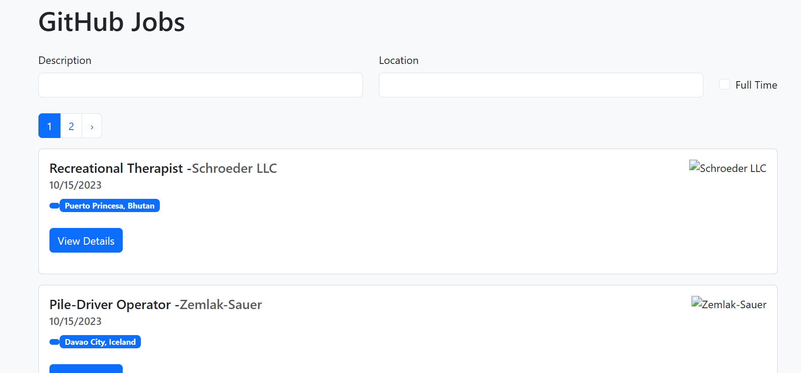
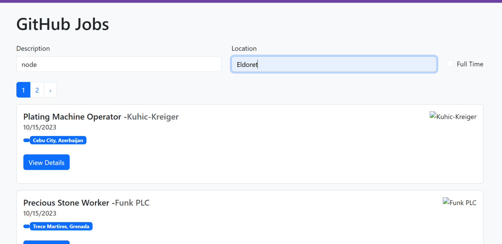

# GitHub Jobs Search App


A **React job search application** that allows users to search and browse job listings with pagination and filtering.

The app fetches jobs from an external API and displays them in a clean interface built with **React Bootstrap**.

---

# Live Demo

(Insert deployed link here)

Example:

```
https://your-project.vercel.app
```

---

# Screenshots

## Job Search Page

Add screenshots in a `screenshots` folder.

```
public/Home_Screenshot.png
public/Search_Screenshot.png
```

Example:





---

# Features

* Job search with filters
* Pagination for browsing results
* Fetch jobs dynamically from API
* Loading and error handling
* Displays up to **25 jobs per page**
* Responsive UI with React Bootstrap

---

# Tech Stack

Frontend:

* React
* JavaScript (ES6)
* React Hooks
* React Bootstrap

Tools:

* Node.js
* npm

---

# Project Structure

```
src
│
├── App.jsx
├── useFetchJobs.js
│
├── component
│   ├── JobPost.jsx
│   └── SearchForm.jsx
│
└── page
    └── JobPage.jsx
```

---

# Application Flow

1. User searches for jobs using the **SearchForm**
2. Search parameters are stored in state
3. The **useFetchJobs hook** fetches jobs from the API
4. Results are displayed as **JobPost components**
5. Users navigate pages using **JobPage**

---

# API Used

This project uses a **Jobs API** to fetch listings.

Example request:

```
GET /jobs?description=react&location=remote&page=1
```

Response example:

```json
{
  "id": "job123",
  "title": "Frontend Developer",
  "company": "Tech Company",
  "location": "Remote"
}
```

---

# Installation

Clone the project:

```
git clone https://github.com/yourusername/github-jobs-app.git
```

Navigate into the project:

```
cd github-jobs-app
```

Install dependencies:

```
npm install
```

Start the development server:

```
npm start
```

---

# Environment Variables

If the API requires configuration, create a `.env` file:

```
VITE_JOBS_API_URL=https://your-api-url
```

---

# Deployment

## Deploy on Vercel

1. Push project to GitHub
2. Go to **vercel.com**
3. Import your repository
4. Click **Deploy**

## Deploy on Netlify

1. Push to GitHub
2. Login to **Netlify**
3. Click **New Site from Git**
4. Select repository

Build command:

```
npm run build
```

Publish directory:

```
dist
```

---

# Future Improvements

* Job details modal
* Save/bookmark jobs
* Infinite scrolling
* Authentication
* Backend caching
* Admin dashboard for job posting

---

# Contributing

Contributions are welcome.

Steps:

1. Fork the project
2. Create a feature branch

```
git checkout -b feature/new-feature
```

3. Commit changes

```
git commit -m "Added new feature"
```

4. Push to GitHub
5. Create Pull Request

---

# License

This project is licensed under the **MIT License**.

---

# Author

KJBabusha :
Software Developer | React | JavaScript | Full-Stack Development
